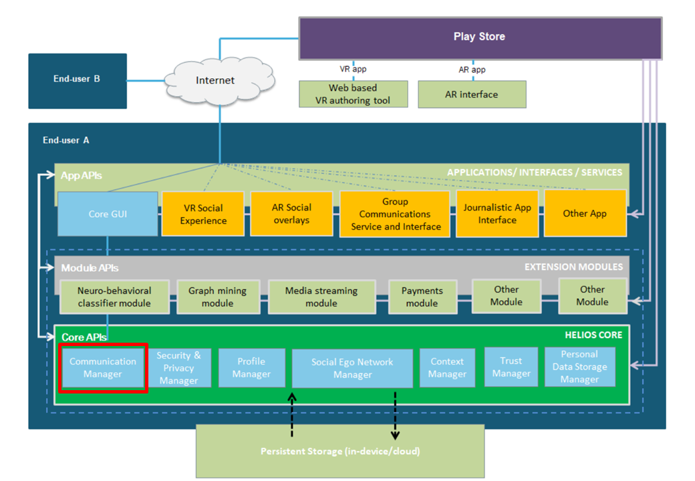

# HELIOS Messaging API #

## Introduction ##

HELIOS Messaging API is used to communicate with other HELIOS nodes. The
current implementation includes API calls that can be used in group chat
application.

HELIOS Messaging API is one of the HELIOS Core APIs provided by HELIOS
Communication Manager as highlighted in the picture below:



## API usage ##

See javadocs in [javadocs.zip](doc/javadocs.zip).

### Introduction ###

Application should include this library by adding it in the specific build.gradle file. An example:

```
configurations.all {
    resolutionStrategy.dependencySubstitution {
        substitute module("eu.h2020.helios_social.core.messaging:messaging") with project(':messaging')
    }
}

dependencies {
    implementation 'eu.h2020.helios_social.core.messaging:messaging:1.0.0'
}
```

The messaging module contains interface classes and basic data structures for
messaging that are utilized by messaging protocol modules that implement real
messaging transactions.

### Interfaces ###

Helios messaging package contain few interface classes that define
interfaces that can be implemented in packages containing messaging
protocol implementations.

#### HeliosMessaging ####

Messaging protocol implementations are expected to implement
`HeliosMessaging` interface. The main methods of the interface are:

* `connect` - Connect to the network.

* `disconnect` - Disconnect from the network.

* `publish` - Publish a message to a specific topic.

* `subscribe` - Subscribe to receive messages from a specific topic.

* `unsubscribe` - Unsubscribe earlier topic subscription.

#### HeliosStorageHelper ####

This interface contains methods to download and upload files to
storage. Storage-specific classes are expected to implement the
methods of the interface.

#### HeliosMessageListener ####

This is an interface that includes a callback function that is called
when a message is received from a connection.

### Container classes ###

HELIOS messaging classes specify data structures that could be used in
messaging applications.

#### HeliosMessage ####

The class encapsulates messages that will be sent to other nodes. The
current implementation is a string. Future version could add more
structured alternatives.

#### HeliosTopic #####

The class to encapsulate HELIOS topic.

#### HeliosTopicMessageContainer #####

The class encapsultes HeliosTopic and HeliosMessage into one container.

#### HeliosIdentityInfo ####

This contains the user nickname and a UUID for the user that should be
set. Note that the UUID should be generated once and thereafter be
reused. Application using this module should store and provide the
UUID for the use at this point.

### Example usage ###

Application developers are expected to use messaging protocol
implementation classes to to create an object (here called
`mHeliosMessaging` that implements `HeliosMessaging` interface.
should call the method in order to get a singleton object.

After that, teh following steps should be done:

1. Set a Storage helper class. The class should implement HeliosStorageHelper interface.\
`setStorageHelper(new StorageHelperClass(this.getApplicationContext()));`

2. Connect - remember to provide a HeliosIdentityInfo object with nickname and UUID.\
`connect(heliosConnectionInfo, heliosIdentityInfo);`\
```
connect(new HeliosConnectionInfo(), new HeliosIdentityInfo(HeliosUserData.getInstance().getValue("username"),
                        HeliosUserData.getInstance().getValue("eu.h2020.helios_social.USER_ID")));
```

3. Subscribe to a topic with a listener (`HeliosMessageListener`).\
`subscribe(heliosTopic, mHeliosReceiver);`

4. Publish a message.\
`publish(heliosTopic, heliosMessage);`\
This can be called from the application side. Topic and Message are defined in Messaging module.
Note: The messaging module takes in a raw String message. Currently, JSON-serialization is app-specific.

5. Other methods\
See javadocs in [javadocs.zip](doc/javadocs.zip).


### Future work ###

* Message serialization (JSON or other) should be integrated into the Messaging module to have interoperability more easily. 
* Add suggestions here or create a new issue under this repository.


## Android Studio project structure ##

This Android Studio 4.0 project contains the following components:

* app - Messaging API test application

* doc - Additional documentation files

* lib - Messaging API implementation
